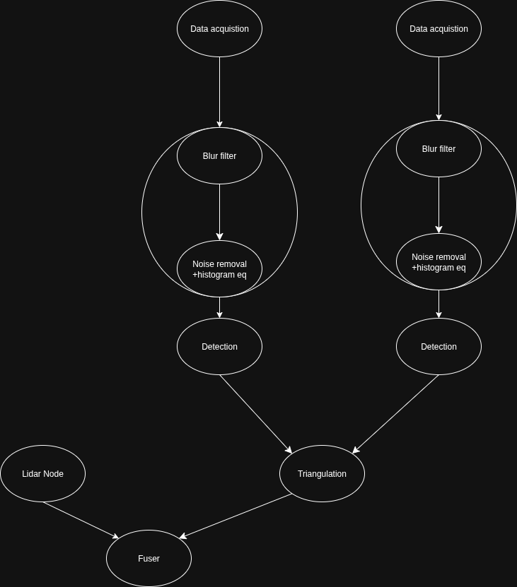

# ROS2

## What is ROS2?

**ROS 2 (Robot Operating System 2)** is an open-source robotics middleware framework designed to build robust, scalable, and modular robot applications. It is the successor to ROS 1 and was created to address the limitations of the original system, especially for use in production environments and real-time, safety-critical applications.

ROS 2 is built from the ground up with modern technologies and industry standards, such as the **DDS (Data Distribution Service)** communication protocol, and supports **multi-platform development** (Linux, Windows, macOS, and embedded systems).

---

## Why Use ROS2?

ROS2 offers several improvements over ROS1, making it better suited for both research and real-world deployment:

- **Real-Time Support**: Ideal for time-critical applications like autonomous driving or robotic surgery.
- **Cross-Platform**: Supports Linux, Windows, and macOS.
- **DDS-Based Middleware**: Enables scalable, robust communication.
- **Security Features**: Includes tools for encrypted and authenticated communication.
- **Better Multi-Robot Support**: Easier to coordinate multiple robots.
- **Active Community & Industry Support**: Backed by companies like Open Robotics, Bosch, and Amazon.

---

## ROS2 Humble Hawksbill

**Humble** is one of the **Long-Term Support (LTS)** releases of ROS2, officially named **Humble Hawksbill**, released in **May 2022** with support until **May 2027**.

### Why Choose Humble?

- **Stable** and widely used in both industry and academia.
- **LTS Support**: Security and patch updates for 5 years.
- **Extensive Documentation** and community tutorials.
- **Compatible with many major ROS 2 packages and tools**.

---

## ROS2 Architecture Overview

ROS2 follows a **modular, distributed architecture** where various processes (called nodes) communicate with each other using clearly defined interfaces.

###  Core Concepts:

| Concept | Description |
|--------|-------------|
| **Nodes** | Independent executable components that perform specific functions (e.g., a camera node, motor controller node). |
| **Topics** | Asynchronous publish/subscribe system for data (e.g., a sensor node publishes to `/camera/image_raw`). |
| **Services** | Synchronous request/reply communication, useful for commands or configuration. |
| **Actions** | Handles long-running goals like "navigate to position" with feedback. |
| **Messages** | Typed data structures used to send information between nodes via topics. |
| **Packages** | Self-contained units of ROS software, including code, dependencies, launch files, and configuration. |

---

## Why ROS2 Inside Docker?

### Simplified Setup & Portability

ROS2 offers official Docker images that are pre-configured and functional out of the box, eliminating the need for complex installation steps or environment configuration. This makes it easy to get up and running quickly, especially when working across multiple machines or teams.

By using Docker, I can spin up a clean ROS2 environment in seconds, without worrying about dependency conflicts or OS-specific issues. It also helps avoid "it works on my machine" problems during development and deployment.

---

### Exploring Distributed ROS2

One of my main motivations for using Docker is to explore and understand the **distributed communication capabilities** of ROS2.

ROS2 nodes communicate over DDS, which enables communication across different machines on a network. Running multiple Docker containers, either on the same host or across different machines, makes it easy to simulate and test multi-node and multi-robot setups, all while keeping environments isolated and reproducible.

This approach allows for:

- Testing **multi-host communication** (e.g., simulating one robot per container or per host).
- Running **containerized simulations** with tools like Gazebo.
- Experimenting with **ROS 2 launch files** across distributed systems.

---

### Peace of Mind: Repeatable and Reliable Builds

Docker gives me peace of mind by making the ROS2 environment **fully reproducible**.

Instead of manually configuring every dependency, I can just write a `Dockerfile` and know that:

- I can rebuild the container in minutes if something breaks.
- The environment can be version-controlled along with the codebase.

This is especially useful when integrating ROS2 with other tools or libraries (e.g., OpenCV, TensorFlow, or custom robotics SDKs), where compatibility issues can be time-consuming to resolve manually.

---
## Project Architecture

# 
The arhitecture of the project is shown in figure 1. 

### Nodes
Each ellipse in the diagram represents one or more **ROS2 nodes**.  

### Data Acquisition (Camera Node)
I have used a ROS2 node that offers support for different kind of camera/stacks. 

### Blur filter and Noise removal
The blur filter is intentded to filter out blurry images that are not useful for AI detection. Since the setup is static this node is currently left **empty** (no op). The noise removal node performs histogram equalization on each RGB channel and applies a median filter. These 2 nodes have been "composed" which is a way to tell ROS2 to use IPC between these 2 nodes instead of the network stack.

### Detection
For real-time object detection, I integrated **YOLOv11** (You Only Look Once - version 11) into my system. YOLOv11 is a fast and accurate single-stage object detector, ideal for edge devices like the Raspberry Pi or Jetson platforms due to its efficiency and speed.

I used the **pretrained standard YOLOv11 model**, which was sufficient for general-purpose detection tasks such as identifying vehicles in the camera feed.To integrate YOLOv11 into the ROS2 ecosystem, I wrote a node in Python because I could not get the C++ OpenCV cdnn module to work properly.

### Lidar 
I have used the node provided by the manufacturer Slamtec. The node reads the data and then publish it to a topic /scan.

### Triangulation 
This node is designated to make a 3D estimation of the points in the area of interest and publish the points in the same format as the lidar node.

### Fuser 
The node converts the lidar messages to PointCloud2 and the Triangulation messages to PointCloud2 (I have chosen PointCloud2 message because i can assign a color to each point).

---

## Summary

Using ROS2 inside Docker enables a faster, cleaner, and more controlled development process. It allows for:

- Quick setup and teardown of environments.
- Safe experimentation with distributed ROS2 features.
- Reliable and repeatable builds across machines and team members.