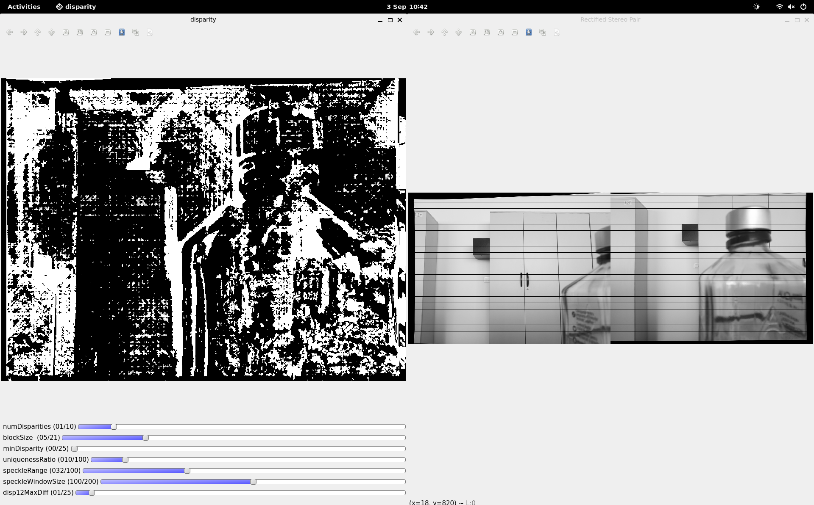
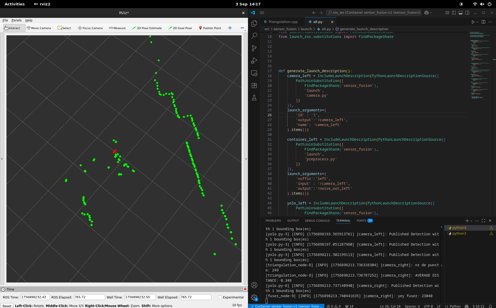
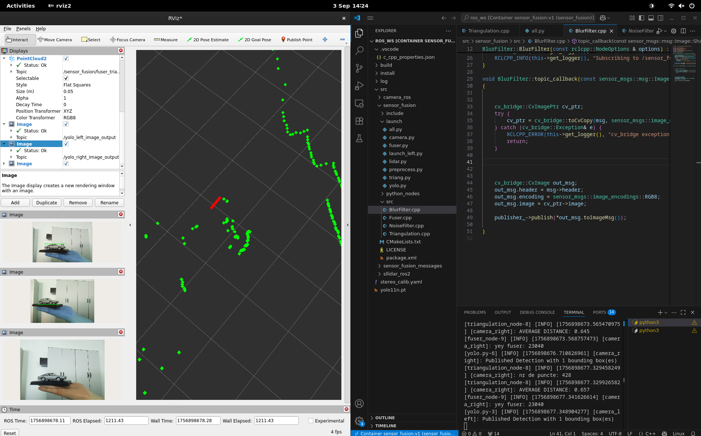
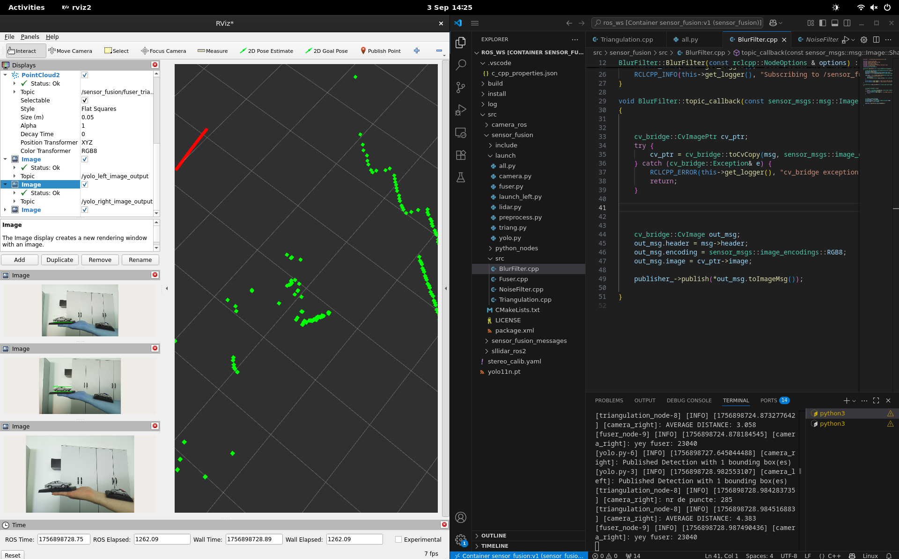
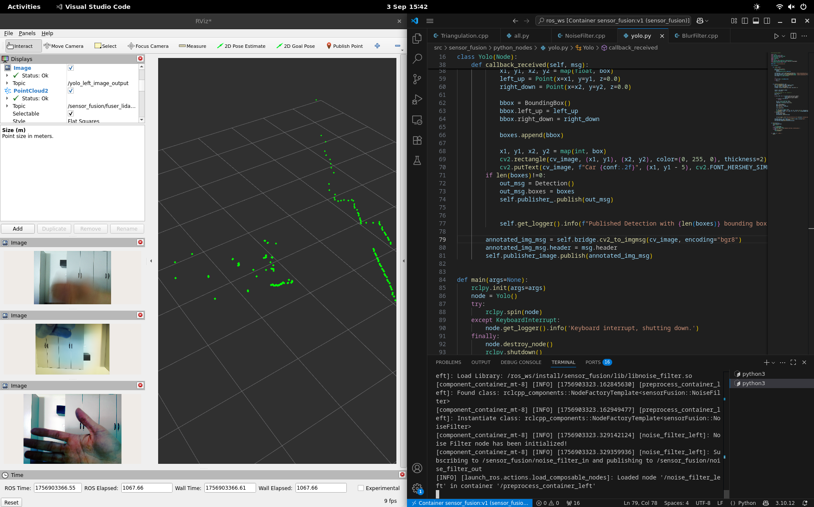
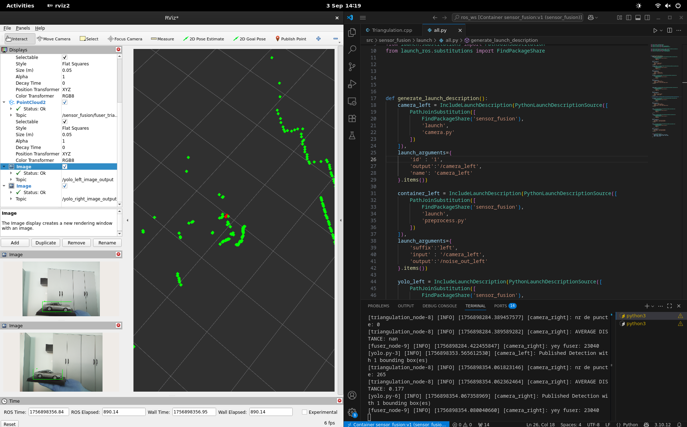

# Screenshots

As it can be seen in the picture above, the calibration is very important for determining the 3D pose. This is the best result I got and it still has a lot of noise and the images are still not rectified correctly.

The red point is the detected car, the green points are from the lidar. In the terminal it can be seen that the "average" distance is 0.34m which was around the real value.

In this example I have also added the images produced by the yolo with the bounding boxes. As it can be seen the distance is not close to the reality.

The above screenshots show other problems such as very off results, the inverted image or the rotated and inverted images. The bad results are mostly caused by the calibration parameters + the poses of the camera. The inverted and rotated images are rare occurances as there is a problem with the OS running on the raspberry pi 5 (as far as I have understood).